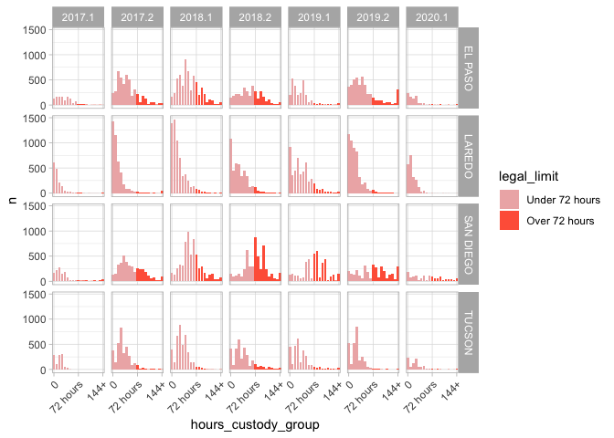
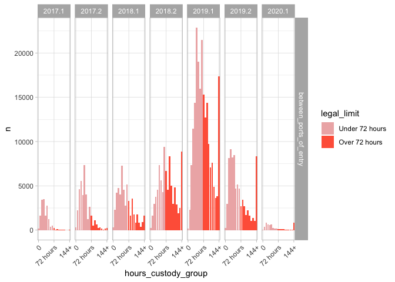
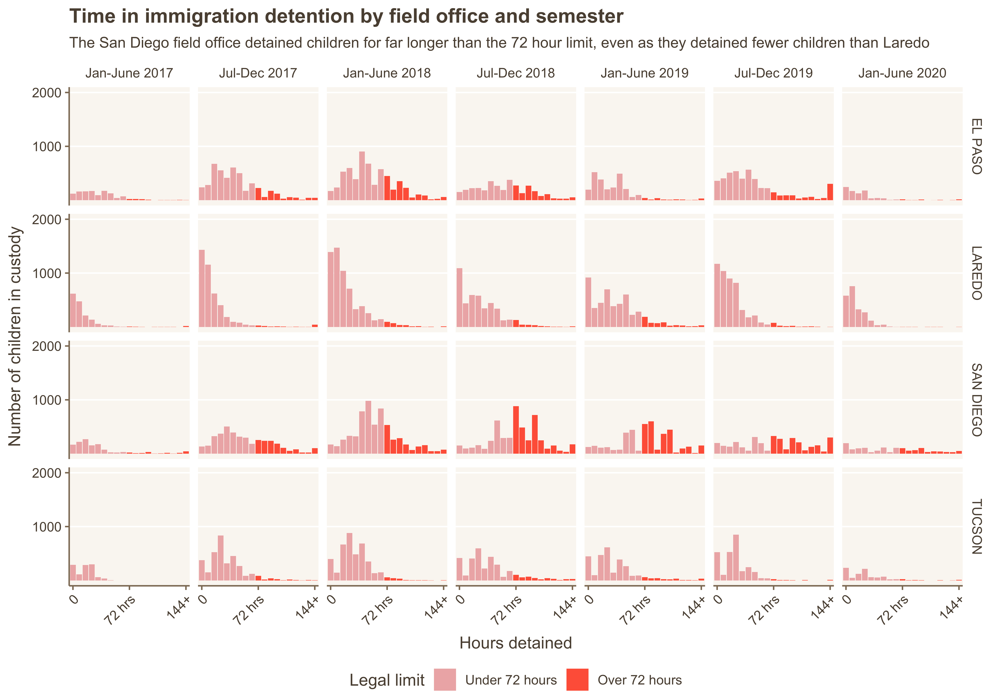

child\_detention
================
Vikas Maturi
2021-10-31

## Data import

The data is a combination of two sources:

CBP Office of Field Operations (OFO) child detentions: Detentions of
children at ports of entry by the U.S. Customs and Border Protection
Border Patrol between mid-January of 2017 and late January of 2020. CBP
Border Patrol (BP) child detentions: Detentions of children between
ports of entry by the U.S. Customs and Border Protection Office of Field
Operations between mid-January of 2017 and mid-June of 2020.

The file includes these fields:

date\_in: Custody book-in time and date date\_out: Custody book-out time
and date app\_date: Apprehension date (OFO dataset) hours\_in\_custody:
Time in custody in hours age\_group: Age group of child (grouped by
Marshall Project reporters) gender: Child gender citizenship: Child
country of citizenship border: Border (BP dataset) field\_office: Field
office name (OFO dataset) source: Data source; “OFO” or “BP”.

Summary of the data sources is from the Marshall Project

``` r
# load library for pipes
library(magrittr)

data_raw <- 
  readr::read_csv(
    file = "https://raw.githubusercontent.com/themarshallproject/cbp-migrantchildren-detention-data/main/data/cbp_foia_response-oct_2020.csv", 
    col_types = list(
      readr::col_datetime(format = ""),
      readr::col_datetime(format = ""),
      readr::col_character(),
      readr::col_double(),
      readr::col_character(),
      readr::col_character(),
      readr::col_character(),
      readr::col_character(),
      readr::col_character(),
      readr::col_character(),
      readr::col_character()
    )
  )
```

Assess data for cleanlinesss/completeness

``` r
data_raw %>% 
  dplyr::count(field_office)
```

    ## # A tibble: 5 × 2
    ##   field_office      n
    ##   <chr>         <int>
    ## 1 EL PASO       23140
    ## 2 LAREDO        28424
    ## 3 SAN DIEGO     25259
    ## 4 TUCSON        18167
    ## 5 <NA>         488818

The “NA” refer to children apprehended between ports of entry (and thus
within the Border Patrol dataset rather than the OFO dataset). Those
apprehended at a field office also have an additional “apprehension
date” column.

``` r
data_raw %>% 
  dplyr::count(age_group)
```

    ## # A tibble: 8 × 2
    ##   age_group         n
    ##   <chr>         <int>
    ## 1 1-2 years     53092
    ## 2 12-14 years   78986
    ## 3 15-18 years  191308
    ## 4 3-5 years     91849
    ## 5 6-8 years     85108
    ## 6 9-11 years    68488
    ## 7 Under 1 year  14956
    ## 8 <NA>             21

``` r
data_clean <-
  data_raw %>% 
  dplyr::mutate(
    field_office = dplyr::case_when(
      is.na(field_office) ~ "between_ports_of_entry",
      !is.na(field_office) ~ field_office,
      TRUE ~ field_office
    )
  ) %>% 
  # filter out entries where we do not have recorded date_in or date_out data
  dplyr::filter(!is.na(date_out), !is.na(date_in)) %>% 
  # add hours in custody where not recorded
  dplyr::mutate(
    manually_added_hours = dplyr::if_else(is.na(hours_in_custody), 1, 0), 
    hours_in_custody = dplyr::case_when(
      !is.na(hours_in_custody) ~ hours_in_custody, 
      is.na(hours_in_custody) ~ round(as.numeric(difftime(date_out, date_in, units = "hours")), 4),
      TRUE ~ NaN
    ),
    age_group = factor(age_group, levels = c("Under 1 year", "1-2 years", "3-5 years", "6-8 years", "9-11 years", "12-14 years", "15-18 years"))
  ) %>% 
  # fill in data for hours_in_custody when the date_in and date_out information are available
  dplyr::filter(hours_in_custody > 0)
```

Note: for the entries where hours\_in\_custody was added, many of them
are among the largest hours\_in\_custody of any children. Why is this
the case? Ask team at Marshall Project\!

## Length of detention analysis

#### What are the longest times children spent in detention?

``` r
detention_length <- 
  data_clean %>% 
  dplyr::arrange(dplyr::desc(hours_in_custody)) %>% 
  dplyr::mutate(days_in_custody = hours_in_custody / 24) %>% 
  dplyr::select(date_in, date_out, hours_in_custody, days_in_custody, manually_added_hours, dplyr::everything())

num_over_72_hours <-
  detention_length %>% 
  dplyr::filter(days_in_custody > 3) %>% 
  dplyr::count()

num_over_72_hours
```

    ## # A tibble: 1 × 1
    ##        n
    ##    <int>
    ## 1 193922

``` r
total_num_children <- 
  data_clean %>% 
  dplyr::count() %>% 
  dplyr::pull() %>% 
  purrr::pluck(1)

num_over_x_days <-
  detention_length %>% 
  dplyr::filter(days_in_custody > 3) %>% 
  dplyr::mutate(round_days_in_custody = round(days_in_custody, 0)) %>% 
  dplyr::count(round_days_in_custody) %>%  
  dplyr::rename(num_of_children = n) %>% 
  dplyr::arrange(dplyr::desc(round_days_in_custody)) %>% 
  dplyr::mutate(
    num_of_children_higher_days = cumsum(num_of_children), 
    prop_children_higher_days = round(num_of_children_higher_days / total_num_children, 6)
  )


num_over_x_days
```

    ## # A tibble: 105 × 4
    ##    round_days_in_custody num_of_children num_of_children_… prop_children_h…
    ##                    <dbl>           <int>             <int>            <dbl>
    ##  1                   586               1                 1         0.000002
    ##  2                   558               1                 2         0.000003
    ##  3                   371               1                 3         0.000005
    ##  4                   258               1                 4         0.000007
    ##  5                   247               1                 5         0.000009
    ##  6                   240               2                 7         0.000012
    ##  7                   224               1                 8         0.000014
    ##  8                   211               1                 9         0.000015
    ##  9                   205               1                10         0.000017
    ## 10                   204               1                11         0.000019
    ## # … with 95 more rows

The understood legal limit is 3 days, though there are waivers if there
are large numbers of children crossing the border at once. We find here
that:

\[NEED TO UPDATE\]

  - 193757 children (33% of all children) were detained for longer than
    72 hours
  - 47636 children (8% of all children) detained for 6 days - 2x longer
    than the legal limit
  - 11,609 children (1.9% of all children) detained for 9 days - 3x
    longer than legal limit
  - 1,265 children detained longer than 18 days (6x longer than legal
    limit)
  - 189 children longer than 1 month
  - 6 children longer than 3 months
  - 5 children longer than 100 days
  - 3 children for more than 6 months (\>189 days)

Data, if accurate, indicate that many children spent longer than the
legal limit - some vastly longer

Full data for children with longest detention times

``` r
detention_length %>% 
  dplyr::arrange(dplyr::desc(hours_in_custody)) %>% 
  head(20)
```

    ## # A tibble: 20 × 13
    ##    date_in             date_out            hours_in_custody days_in_custody
    ##    <dttm>              <dttm>                         <dbl>           <dbl>
    ##  1 2017-02-24 17:15:00 2018-10-03 10:19:00           14057.            586.
    ##  2 2017-03-24 20:20:00 2018-10-03 10:20:00           13382             558.
    ##  3 2017-11-15 19:35:00 2018-11-22 00:00:00            8908.            371.
    ##  4 2019-05-16 13:20:00 2020-01-29 15:45:00            6194.            258.
    ##  5 2017-02-15 00:00:00 2017-10-20 08:26:00            5936.            247.
    ##  6 2018-06-05 15:04:00 2019-01-31 13:02:00            5758.            240.
    ##  7 2018-06-05 15:04:00 2019-01-31 13:02:00            5758.            240.
    ##  8 2018-07-30 04:53:00 2019-03-11 05:01:00            5376.            224.
    ##  9 2017-11-16 18:30:00 2018-06-16 05:45:00            5075.            211.
    ## 10 2019-07-04 16:20:00 2020-01-25 13:36:00            4917.            205.
    ## 11 2019-10-31 13:14:00 2020-05-22 19:32:00            4902.            204.
    ## 12 2019-07-15 16:00:00 2020-01-22 14:03:00            4582.            191.
    ## 13 2019-04-04 06:35:00 2019-10-11 09:39:00            4563.            190.
    ## 14 2019-05-08 15:32:00 2019-11-14 15:27:00            4560.            190.
    ## 15 2019-05-08 15:32:00 2019-11-14 15:27:00            4560.            190.
    ## 16 2017-12-20 18:10:00 2018-06-27 13:50:14            4532.            189.
    ## 17 2017-12-20 18:15:00 2018-06-27 13:50:14            4532.            189.
    ## 18 2019-05-12 23:35:00 2019-11-08 16:17:00            4313.            180.
    ## 19 2019-05-12 23:35:00 2019-11-08 16:17:00            4313.            180.
    ## 20 2019-07-15 10:30:00 2020-01-10 16:20:00            4302.            179.
    ## # … with 9 more variables: manually_added_hours <dbl>, app_date <chr>,
    ## #   age_group <fct>, gender <chr>, citizenship <chr>, border <chr>,
    ## #   sector <chr>, field_office <chr>, source <chr>

Note that many of those with longest times were manually added into the
data (the calculation of their hours was not done in the default dataset
from the Marshall Project)

#### How does time in custody vary by site?

``` r
field_over_time <-
  data_clean %>% 
  dplyr::mutate(
    semester = lubridate::semester(date_in, with_year = TRUE),
    hours_custody_group = round(hours_in_custody / 8, 0),
    hours_custody_group = dplyr::case_when(
      hours_custody_group == 0 ~ "0 to 8 hours",
      hours_custody_group == 1 ~ "8 to 16 hours",
      hours_custody_group == 2 ~ "16 to 24 hours",
      hours_custody_group == 3 ~ "24 to 32 hours", 
      hours_custody_group == 4 ~ "32 to 40 hours",
      hours_custody_group == 5 ~ "40 to 48 hours", 
      hours_custody_group == 6 ~ "48 to 56 hours", 
      hours_custody_group == 7 ~ "56 to 64 hours", 
      hours_custody_group == 8 ~ "64 to 72 hours", 
      hours_custody_group == 9 ~ "72 to 80 hours",
      hours_custody_group == 10 ~ "80 to 88 hours", 
      hours_custody_group == 11 ~ "88 to 96 hours", 
      hours_custody_group == 12 ~ "96 to 104 hours", 
      hours_custody_group == 13 ~ "104 to 112 hours", 
      hours_custody_group == 14 ~ "112 to 120 hours",
      hours_custody_group == 15 ~ "120 to 128 hours", 
      hours_custody_group == 16 ~ "128 to 136 hours", 
      hours_custody_group == 17 ~ "136 to 144 hours", 
      hours_custody_group > 17 ~ "144 hours or more",
      TRUE ~ NA_character_
    ),
    hours_custody_group = factor(
      hours_custody_group, 
      levels = c("0 to 8 hours", "8 to 16 hours", "16 to 24 hours", "24 to 32 hours", "32 to 40 hours", "40 to 48 hours", "48 to 56 hours", "56 to 64 hours", "64 to 72 hours", "72 to 80 hours", "80 to 88 hours", "88 to 96 hours", "96 to 104 hours", "104 to 112 hours", "112 to 120 hours", "120 to 128 hours", "128 to 136 hours", "136 to 144 hours", "144 hours or more"), 
      ordered = TRUE)
  ) %>% 
  dplyr::count(hours_custody_group, semester, field_office) %>% 
  dplyr::mutate(
    legal_limit = ifelse(hours_custody_group %in% c("0 to 8 hours", "8 to 16 hours", "16 to 24 hours", "24 to 32 hours", "32 to 40 hours", "40 to 48 hours", "48 to 56 hours", "56 to 64 hours", "64 to 72 hours"), "Under 72 hours", "Over 72 hours"),
    legal_limit = factor(legal_limit, ordered = TRUE, levels = c("Under 72 hours", "Over 72 hours"))
  )


field_over_time %>% 
  dplyr::filter(!field_office == "between_ports_of_entry") %>% 
  ggplot2::ggplot(ggplot2::aes(x = hours_custody_group, y = n, fill = legal_limit, group = legal_limit)) +
  ggplot2::geom_col() + 
  ggplot2::facet_grid(field_office~semester) +
  ggplot2::theme_light() +
  ggplot2::scale_fill_manual(values = c("rosybrown2", "tomato1")) +
  ggplot2::scale_x_discrete(breaks = c("0 to 8 hours", "72 to 80 hours", "144 hours or more"), labels = c("0", "72 hours", "144+")) +
  ggplot2::theme(
    axis.text.x = ggplot2::element_text(angle = 45, hjust = 1)
  )
```

<!-- -->

Of detentions happening at border patrol sites, those happening in San
Diego are far more likely to result in detention lengths far longer than
legally allowed. Conversely, Laredo has similar number of detentions,
but far more childre are detained for less than 72 hours.

``` r
field_over_time %>% 
  dplyr::filter(field_office == "between_ports_of_entry") %>% 
  ggplot2::ggplot(ggplot2::aes(x = hours_custody_group, y = n, fill = legal_limit, group = legal_limit)) +
  ggplot2::geom_col() + 
  ggplot2::facet_grid(field_office~semester) +
  ggplot2::theme_light() +
  ggplot2::scale_fill_manual(values = c("rosybrown2", "tomato1")) +
  ggplot2::scale_x_discrete(breaks = c("0 to 8 hours", "72 to 80 hours", "144 hours or more"), labels = c("0", "72 hours", "144+")) +
  ggplot2::theme(
    axis.text.x = ggplot2::element_text(angle = 45, hjust = 1)
  )
```

<!-- -->

For those children detained betwee port of entry, we find that many -
particularly at the peak of detentions in the first six months of 2019 -
were detained more than 72 hours.

#### How old were the children detained for long periods of time?

``` r
one_month <-
  detention_length %>% 
  dplyr::filter(days_in_custody > 29) %>% 
  dplyr::count(age_group)

one_month
```

    ## # A tibble: 7 × 2
    ##   age_group        n
    ##   <fct>        <int>
    ## 1 Under 1 year    18
    ## 2 1-2 years       44
    ## 3 3-5 years       68
    ## 4 6-8 years       58
    ## 5 9-11 years      56
    ## 6 12-14 years     48
    ## 7 15-18 years     78

``` r
one_month %>% 
  ggplot2::ggplot(ggplot2::aes(x = age_group, y = n)) +
  ggplot2::geom_col() +
  ggplot2::theme_light() +
  ggplot2::theme(
    axis.text.x = ggplot2::element_text(angle = 45, hjust = 1)
  )
```

<!-- -->

Over 100 children 5 and under were detained for 30+ days

## How does migration vary by nationality and age

``` r
total_cross_nationality <-
  data_clean %>% 
  dplyr::count(citizenship) %>% 
  dplyr::arrange(dplyr::desc(n)) %>% 
  dplyr::filter(n > 3000) %>% 
  dplyr::pull(citizenship)

nationality_crossing <-
  data_clean %>% 
  dplyr::count(citizenship, age_group) %>% 
  dplyr::filter(citizenship %in% total_cross_nationality, !is.na(age_group))

nationality_crossing %>% 
  ggplot2::ggplot(ggplot2::aes(x = age_group, y = n)) +
  ggplot2::geom_col() +
  ggplot2::facet_wrap(~citizenship) +
  ggplot2::theme_light() +
  ggplot2::theme(
    axis.text.x = ggplot2::element_text(angle = 45, hjust = 1)
  )
```

<!-- -->

Many older minors (particularly from Guatemala), though a substantial
proportion are young.
